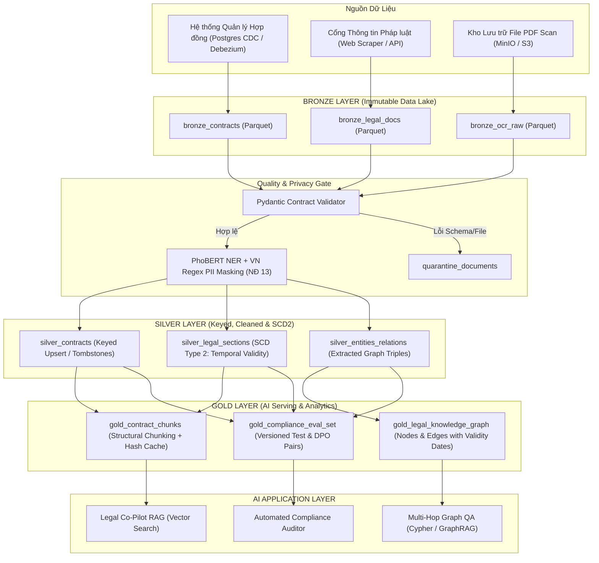

# BONUS B2 — Hệ Thống Pipeline Dữ Liệu Cho Trợ Lý AI Pháp Lý & Hợp Đồng Doanh Nghiệp (Enterprise Legal & Contract Intelligence)

## 1. Bối cảnh & Ràng buộc bài toán thực tế

### 1.1 Bài toán nghiệp vụ
Các tập đoàn đa ngành tại Việt Nam quản lý hàng chục nghìn hợp đồng (kinh tế, lao động, mua sắm, đối tác) cùng hàng loạt văn bản quy phạm pháp luật (Luật Đất đai, Luật Đấu thầu, Luật Nhà ở, các Nghị định/Thông tư hướng dẫn sửa đổi liên tục). Đội ngũ pháp chế và ban điều hành cần một **Trợ lý AI chuyên sâu (Legal Co-pilot)** để:
- Trả lời các câu hỏi phức tạp mang tính tổng hợp đa bước (multi-hop reasoning), ví dụ: *"Điều khoản phạt vi phạm trong hợp đồng khung với Nhà thầu X năm 2023 có còn hiệu lực khi áp dụng theo Nghị định mới ban hành tháng 06/2024 không?"*
- Tự động rà soát rủi ro tuân thủ (Compliance Check) khi có sự thay đổi trong hệ thống pháp luật hoặc chính sách nội bộ.

### 1.2 Ràng buộc thực tế phức tạp (Messy Constraints)
1. **Dữ liệu phi cấu trúc và định dạng phức tạp:** Tài liệu hợp đồng đến từ nhiều nguồn (scan PDF chất lượng thấp, văn bản Word sửa đổi nhiều phiên bản qua phụ lục hợp đồng, biểu bảng phức tạp).
2. **Tính hợp lệ theo thời gian (Temporal Validity & Version Drift):** Văn bản luật và phụ lục hợp đồng có ngày bắt đầu hiệu lực (`effective_from`) và ngày hết hiệu lực (`effective_to`). Rò rỉ thông tin tương lai hoặc áp dụng sai mốc thời gian là lỗi nghiêm trọng.
3. **Bảo mật dữ liệu cá nhân & dữ liệu doanh nghiệp (Nghị định 13/2023/NĐ-CP):** Hợp đồng chứa đầy đủ PII (CCCD/CMND, mã số thuế, tài khoản ngân hàng, họ tên đại diện pháp luật, số tiền giao dịch). Dữ liệu nhạy cảm phải được phát hiện, che/tokenize trước khi vector hóa hoặc đưa vào context của LLM.
4. **Quyền được lãng quên (Right to be Forgotten) & Thu hồi dữ liệu:** Khi hợp đồng hết thời hạn lưu trữ hoặc đối tác yêu cầu xóa dữ liệu, hệ thống phải truyền thao tác xóa (cascade deletion) xuống toàn bộ Vector DB, Knowledge Graph và Cache.

---

## 2. Các quyết định kỹ thuật then chốt & Đánh đổi (Architectural Decisions & Trade-offs)

### Quyết định 1: Hybrid Retrieval (Vector DB + Knowledge Graph) vs Pure Vector Search (RAG thuần)
- **Bối cảnh:** Câu hỏi pháp lý thường đòi hỏi truy vết đa bước qua nhiều thực thể (Văn bản gốc → Văn bản sửa đổi, bổ sung → Điều khoản cụ thể trong Hợp đồng).
- **Lựa chọn:** **Kết hợp Vector Search (Dense Retrieval) + Knowledge Graph (GraphRAG / Cypher Query).**
- **Đánh đổi (X vs Y):**
  - *Vector Search thuần:* Nhanh, chi phí xây dựng pipeline thấp, nhưng thất bại hoàn toàn ở các câu hỏi logic đa bước (multi-hop) và tổng hợp toàn cục (global summarization).
  - *Hybrid Vector + Graph:* Tốn tài nguyên pipeline hơn (cần Entity-Relation Extraction via LLM/NER ở tầng Silver/Gold, duy trì Graph DB như Neo4j/Memgraph), nhưng đảm bảo độ chính xác gần như tuyệt đối cho các quan hệ pháp lý có cấu trúc định danh rõ ràng.

### Quyết định 2: Mô hình Data Lakehouse 3 Tầng (Bronze - Silver - Gold) với Idempotent CDC & SCD Type 2
- **Bối cảnh:** Các hợp đồng và văn bản pháp luật liên tục có phụ lục sửa đổi hoặc hết hiệu lực.
- **Lựa chọn:**
  - **Bronze:** Lưu trữ bất biến (Immutable) các file raw PDF/DOCX, JSON OCR payload, log audit tải lên có partition theo `ingest_date`.
  - **Silver:** Chuẩn hóa OCR, làm sạch văn bản, chạy PII Redaction Pipeline (Mask tên, SĐT, CCCD, Email theo Nghị định 13), trích xuất metadata và lưu lịch sử thay đổi theo **SCD Type 2** (`valid_from`, `valid_to`, `is_current`, `version_hash`).
  - **Gold:** Phân mảnh (chunking) theo ranh giới cấu trúc pháp lý (Chương/Điều/Khoản thay vì fixed token), sinh embedding vector kèm metadata filtering (`effective_date`, `contract_type`), và xây dựng các bộ dữ liệu Evaluation/DPO.
- **Đánh đổi:** Chấp nhận nhân bản dung lượng lưu trữ qua 3 tầng để đổi lấy khả năng **Time-travel**, **Reproducibility** và **Audit trail** tuyệt đối khi giải trình pháp lý.

### Quyết định 3: Temporal-aware Chunking & Point-in-Time Indexing
- **Bối cảnh:** Một câu hỏi pháp lý luôn gắn liền với thời điểm áp dụng vụ việc.
- **Lựa chọn:** Mỗi chunk trong Gold và node trong Graph được gắn metadata `[effective_from, effective_to]`. Khi query, hệ thống tự động tiêm bộ lọc thời gian `AS OF target_date` vào câu lệnh truy vấn Vector/Cypher.
- **Đánh đổi:** Phức tạp hóa pipeline embedding và logic truy vấn, nhưng ngăn chặn hoàn toàn hiện tượng *Temporal Leakage* (lấy luật năm 2024 để phán xử giao dịch phát sinh năm 2022).

### Quyết định 4: Multi-tier PII Protection & Cascade Deletion (Xóa phải lan)
- **Bối cảnh:** Tuân thủ Nghị định 13/2023/NĐ-CP của Việt Nam.
- **Lựa chọn:**
  - Tầng Bronze giữ dữ liệu gốc trong vùng bảo mật mã hóa AES-256 (Restricted Zone).
  - Tầng Silver áp dụng Named Entity Recognition (NER) tiếng Việt (PhoBERT-NER) kết hợp Regular Expressions đặc thù Việt Nam (format CCCD 12 số, Mã số thuế 10-13 số, số điện thoại mạng VN) để che hoặc mã hóa một chiều (Pseudonymization).
  - Thao tác xóa từ nguồn CDC phát sinh `Tombstone` ở Silver và kích hoạt xóa lan (Cascade Delete) theo `contract_id` trên Vector Store, Graph Store và Embedding Cache.

### Quyết định 5: LLM Transform Pipeline với Tiered Model Routing & Deterministic Hash Cache
- **Bối cảnh:** Trích xuất quan hệ thực thể (Entity/Relation) và tóm tắt điều khoản tốn kém token nếu gọi LLM trực tiếp ở mọi lần chạy.
- **Lựa chọn:**
  - Áp dụng Cache Key: `hash(chunk_text) + model_name + prompt_version`. Khi chạy lại hoặc backfill, số lượng LLM API call = 0.
  - Sử dụng mô hình nhỏ, chuyên biệt (Fine-tuned SLM / Gemini Flash) cho tác vụ trích xuất cấu trúc (Entity/Relation extraction), chỉ dùng mô hình lớn (Pro) cho các tác vụ tổng hợp phức tạp.
  - Output bắt buộc tuân theo Pydantic / JSON Schema nghiêm ngặt; bất kỳ phản hồi sai định dạng đều chuyển vào bảng `quarantine_llm_records` để cảnh báo cho kỹ sư dữ liệu.

---

## 3. Phương án kiến trúc bị loại bỏ (Rejected Alternative)

- **Phương án bị loại:** **End-to-End Realtime Streaming Pipeline (Kafka + Apache Flink + Live Vector Ingestion).**
- **Lý do loại bỏ:**
  1. *Đặc thù nghiệp vụ:* Hợp đồng và văn bản pháp luật không yêu cầu độ tươi mili-giây (sub-second latency). Việc cập nhật theo batch định kỳ (Microbatch / Daily Batch hoặc Event-triggered batch qua Object Storage notification) là hoàn toàn đáp ứng SLA nghiệp vụ.
  2. *Chi phí vận hành & Tính ổn định:* Flink và Streaming State Management đòi hỏi chi phí hạ tầng và nhân sự vận hành rất lớn. Việc xử lý OCR văn bản dài và trích xuất Entity qua LLM có độ trễ dao động lớn (variable latency), rất dễ gây nghẽn backpressure trong streaming pipeline.
  3. *Khả năng sửa đổi & Chạy lại (Backfill):* Trong xử lý tài liệu pháp lý, việc kiểm soát phiên bản và chạy lại (replay/backfill) theo batch để đánh giá chất lượng embedding/prompt mới đơn giản, an toàn và ít rủi ro hơn nhiều so với streaming graph updates.

---

## 4. Sơ đồ Kiến trúc Pipeline (Architecture Diagram)

---

## 5. Kết luận
Thiết kế trên giải quyết triệt để 3 thách thức lớn nhất của hệ thống AI pháp lý tại Việt Nam: **sự phức tạp của cấu trúc văn bản đa bước**, **tính hiệu lực theo thời gian (temporal reasoning)**, và **bảo vệ quyền riêng tư dữ liệu theo quy định pháp luật**. Đồng thời, kiến trúc đảm bảo các nguyên lý cốt lõi của Data Pipeline Engineering: Idempotency, Lineage, Cascade Deletion, và Zero-cost Rerun Caching.
